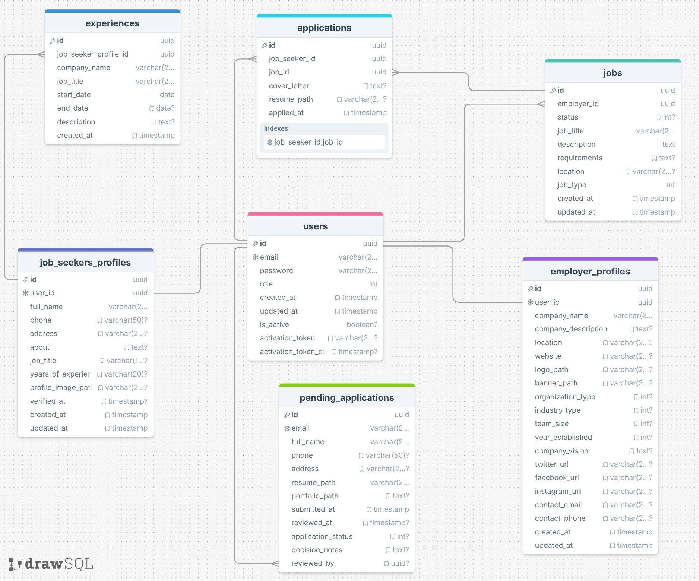
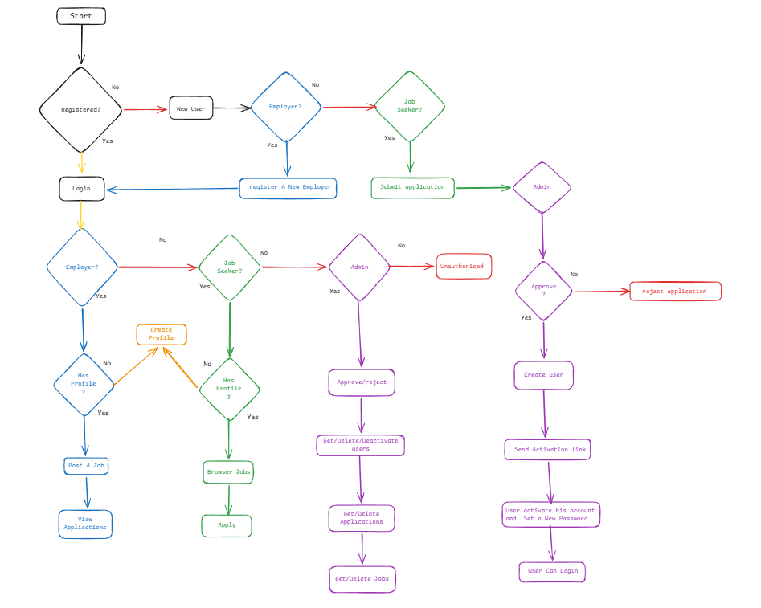
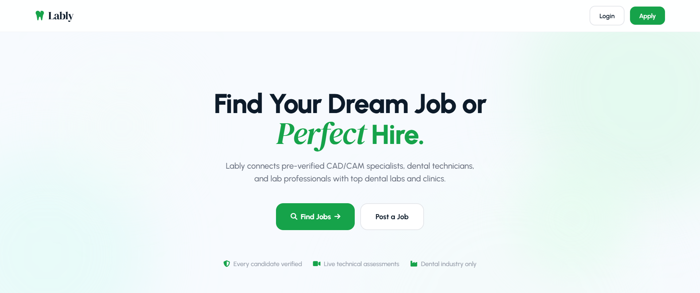
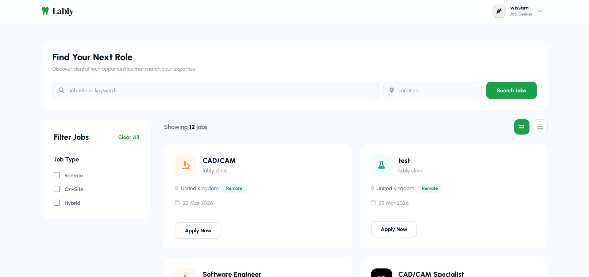
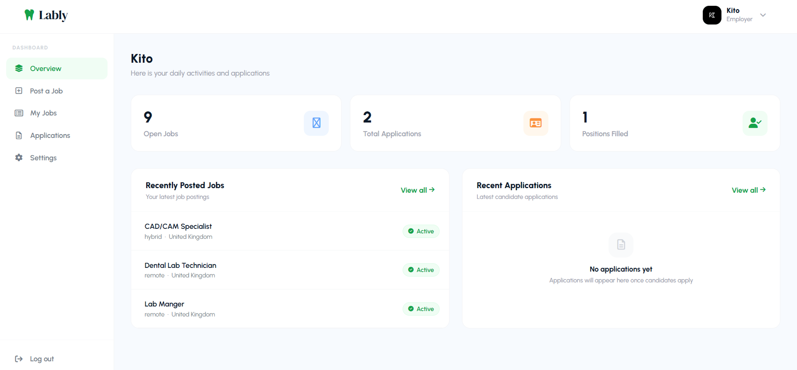
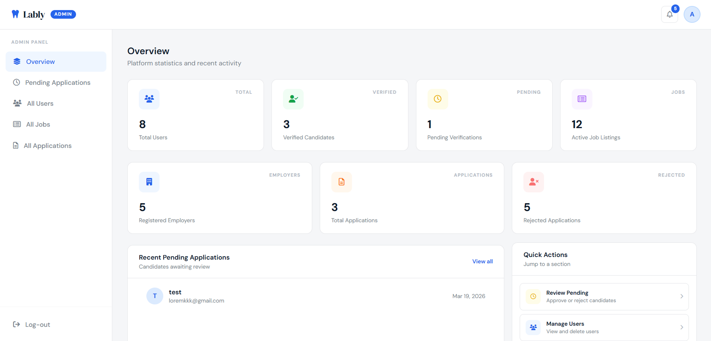

# Lably

## Project Overview
Lably is a specialized job board for the dental technology industry. It connects dental labs and clinics with pre-verified CAD/CAM specialists, dental technicians, and dental lab professionals.

## System Design

#### ER Diagram



#### System Flowchart




For full system design, database decisions, API details, and architecture notes, see [DESIGN.md](./design.md).


## Screenshots

| Landing Page | Job Seeker |
|---|---|
|  |  |

| Employer | Admin |
|---|---|
|  |  |

## Tech Stack

| Frontend | Backend | Database | File Storage | Auth | Email | Testing | CI/CD | Deployment |
|---|---|---|---|---|---|---|---|---|
|    |   |   |  |   |   |   |  |  |

## Testing

Integration tests using **Jest** and **Supertest** against a real PostgreSQL database (Neon) to catch real-world issues that mocks would miss.

### What's Tested

- **Authentication** — login success, wrong password, wrong email
- **Pending Applications** — file upload submission, missing resume validation
- **Activation Flow** — full end-to-end: submit application → admin approves → token validation → account activation → login
- **Jobs** — create, edit, delete, and view job listings
- **Employer Profile** — create and update employer profile
- **Email Service** — mocked to prevent real emails during CI

### Run Tests
```bash
npm test
```

## Setup & Installation

### Prerequisites
- Node.js
- PostgreSQL
- Supabase account
- Brevo account

### 1. Clone the Repository
```bash
git clone https://github.com/MahmoudAlHaj4/Lably.git
cd Lably
```

### 2. Install Dependencies
```bash
cd lably-backend
npm install
```

### 3. Configure Environment Variables
Create a `.env` file in the `lably-backend` directory and fill in the following:
```env
DB_HOST=
DB_USER=
DB_PASSWORD=
DB_NAME=
PORT=
JWT_SECRET=

DATABASE_URL=

SUPABASE_URL=
SUPABASE_SERVICE_ROLE_KEY=

FRONTEND_URL=

BREVO_HOST=
BREVO_PORT=
BREVO_USER=
BREVO_PASS=
BREVO_SENDER=
BREVO_API_KEY=
```

### 4. Start the Server
```bash
node server.js
```
